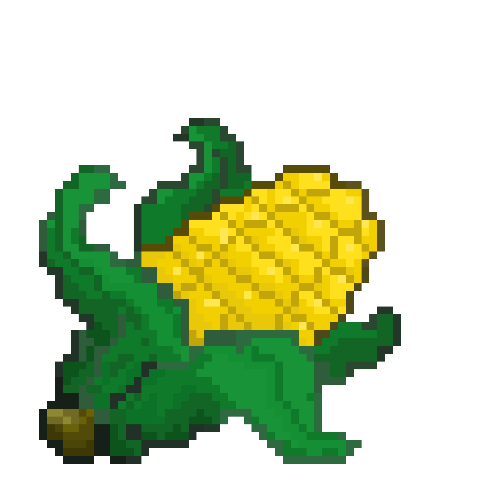

<a id="readme-top"></a>


<!-- PROJECT LOGO -->
<br />
<div align="center">
  <a href="https://github.com/alvrian/project-web-prog">
    
  </a>

  <h3 align="center">FarmByte</h3>

  <p align="center">
    Cultivating Connections, Growing Sustainability
    <br />
    <a href="https://github.com/othneildrew/Best-README-Template"><strong>Explore the docs »</strong></a>
    <br />
    <br />
    <a href="https://github.com/othneildrew/Best-README-Template">View Demo</a>
    ·
    <a href="https://github.com/othneildrew/Best-README-Template/issues/new?labels=bug&template=bug-report---.md">Report Bug</a>
    ·
    <a href="https://github.com/othneildrew/Best-README-Template/issues/new?labels=enhancement&template=feature-request---.md">Request Feature</a>
  </p>
</div>


<!-- TABLE OF CONTENTS -->
<details>
  <summary>Table of Contents</summary>
  <ol>
    <li>
      <a href="#kelompok-7">Kelompok 7</a>
      <ul>
        <li><a href="#task-distribution">Task Distribution</a></li>
      </ul>
      <ul>
        <li><a href="#task-distribution">Task Distribution</a></li>
      </ul>
      <ul>
        <li><a href="#about-farmbyte">About FarmByte</a></li>
      </ul> 
    </li>
    <li>
      <a href="#getting-started">Getting Started</a>
      <ul>
        <li><a href="#prerequisites">Prerequisites</a></li>
        <li><a href="#installation">Installation</a></li>
      </ul>
    </li>
    <li><a href="#usage">Usage</a></li>
    <li><a href="#roadmap">Roadmap</a></li>
    <li><a href="#contributing">Contributing</a></li>
    <li><a href="#license">License</a></li>
    <li><a href="#contact">Contact</a></li>
    <li><a href="#acknowledgments">Acknowledgments</a></li>
  </ol>
</details>


<!-- ABOUT THE PROJECT -->
## Kelompok 7


Kelompok 7:
* 2602057186 - TIFFANY JOYCELYN
* 2602068422 - KEVIN ALEXANDER ANDREAS
* 2602069766 - ALVRIAN TIMOTIUS HINANDRA
* 2602072760 - VINCENTIA CATHERINE

**SDG 12** : Responsible Consumption and Production  
SDG 12 aims to ensure sustainable consumption and production patterns. It focuses on efficient resource use, reducing waste, and promoting sustainable lifestyles to minimize environmental impact and support global sustainability.

<p align="right">(<a href="#readme-top">back to top</a>)</p>


### Task Distribution

The roles and responsibilities of each team member in this project are clearly outlined to ensure efficiency and accountability. The detailed task assignments, progress tracking, and updates can be viewed directly on our project board.

You can access the project board here: [Task Distribution Board](https://webprog.atlassian.net/jira/software/projects/MBA/boards/1)


### About FarmByte

Welcome to **FarmByte**, an innovative platform designed to create a sustainable and mutually beneficial ecosystem by connecting **farmers**, **compost producers**, and **restaurants**. Our application promotes responsible consumption and production, aligning directly with **SDG 12: Responsible Consumption and Production**, which emphasizes efficient resource use, waste reduction, and sustainable practices.

#### How FarmByte Works:
1. **Restaurants**:
   - Restaurants can deposit kitchen waste into the platform, reducing food waste and contributing to eco-friendly practices.
   
2. **Compost Producers**:
   - Compost producers process the deposited waste into high-quality compost, which is then sold to farmers as an organic fertilizer.
   
3. **Farmers**:
   - Farmers use the compost to grow fresh, sustainable produce, which they sell directly to restaurants, completing the circular ecosystem.

#### Connection to SDG 12:
FarmByte embodies **SDG 12** by promoting:
- **Efficient Resource Use**: Transforming waste into valuable compost reduces reliance on chemical fertilizers.
- **Waste Reduction**: Encouraging restaurants to repurpose kitchen waste.
- **Sustainable Practices**: Supporting local farmers and reducing the carbon footprint of food production and supply chains.

By fostering collaboration between these roles, FarmByte not only enhances sustainability but also builds a community that prioritizes environmental responsibility and economic empowerment. Together, we are creating a future where every step of the supply chain supports a greener planet.


<!-- GETTING STARTED -->
## Getting Started

This is an example of how you may give instructions on setting up your project locally.
To get a local copy up and running follow these simple example steps.

### Prerequisites

This is an example of how to list things you need to use the software and how to install them.
* npm
  ```sh
  npm install npm@latest -g
  ```

### Installation

_Below is an example of how you can instruct your audience on installing and setting up your app. This template doesn't rely on any external dependencies or services._

1. Get a free API Key at [https://example.com](https://example.com)
2. Clone the repo
   ```sh
   git clone https://github.com/github_username/repo_name.git
   ```
3. Install NPM packages
   ```sh
   npm install
   ```
4. Enter your API in `config.js`
   ```js
   const API_KEY = 'ENTER YOUR API';
   ```
5. Change git remote url to avoid accidental pushes to base project
   ```sh
   git remote set-url origin github_username/repo_name
   git remote -v # confirm the changes
   ```

<p align="right">(<a href="#readme-top">back to top</a>)</p>


<!-- USAGE EXAMPLES -->
## Usage

Use this space to show useful examples of how a project can be used. Additional screenshots, code examples and demos work well in this space. You may also link to more resources.

_For more examples, please refer to the [Documentation](https://example.com)_

<p align="right">(<a href="#readme-top">back to top</a>)</p>


<!-- ROADMAP -->
## Roadmap

- [x] Add Changelog
- [x] Add back to top links
- [ ] Add Additional Templates w/ Examples
- [ ] Add "components" document to easily copy & paste sections of the readme
- [ ] Multi-language Support
    - [ ] Chinese
    - [ ] Spanish

See the [open issues](https://github.com/othneildrew/Best-README-Template/issues) for a full list of proposed features (and known issues).

<p align="right">(<a href="#readme-top">back to top</a>)</p>


<!-- CONTRIBUTING -->
## Contributing

Contributions are what make the open source community such an amazing place to learn, inspire, and create. Any contributions you make are **greatly appreciated**.

If you have a suggestion that would make this better, please fork the repo and create a pull request. You can also simply open an issue with the tag "enhancement".
Don't forget to give the project a star! Thanks again!

1. Fork the Project
2. Create your Feature Branch (`git checkout -b feature/AmazingFeature`)
3. Commit your Changes (`git commit -m 'Add some AmazingFeature'`)
4. Push to the Branch (`git push origin feature/AmazingFeature`)
5. Open a Pull Request

### Top contributors:

<a href="https://github.com/othneildrew/Best-README-Template/graphs/contributors">
  
</a>

<p align="right">(<a href="#readme-top">back to top</a>)</p>


<!-- LICENSE -->
## License

Distributed under the Unlicense License. See `LICENSE.txt` for more information.

<p align="right">(<a href="#readme-top">back to top</a>)</p>


<!-- CONTACT -->
## Contact

Your Name - [@your_twitter](https://twitter.com/your_username) - email@example.com

Project Link: [https://github.com/your_username/repo_name](https://github.com/your_username/repo_name)

<p align="right">(<a href="#readme-top">back to top</a>)</p>


<!-- ACKNOWLEDGMENTS -->
## Acknowledgments

Use this space to list resources you find helpful and would like to give credit to. I've included a few of my favorites to kick things off!

* [Choose an Open Source License](https://choosealicense.com)
* [GitHub Emoji Cheat Sheet](https://www.webpagefx.com/tools/emoji-cheat-sheet)
* [Malven's Flexbox Cheatsheet](https://flexbox.malven.co/)
* [Malven's Grid Cheatsheet](https://grid.malven.co/)
* [Img Shields](https://shields.io)
* [GitHub Pages](https://pages.github.com)
* [Font Awesome](https://fontawesome.com)
* [React Icons](https://react-icons.github.io/react-icons/search)

<p align="right">(<a href="#readme-top">back to top</a>)</p>


<!-- MARKDOWN LINKS & IMAGES -->

